# Features

Every capability implemented in the codebase — **all 72 use cases, each with an end-to-end flow
diagram** running from the HTTP client, through the controller, the MediatR pipeline and the handler,
out to MongoDB / Redis / RabbitMQ / R2, and back to the HTTP response.

Endpoint count equals handler count: 12 controllers → 72 actions → 72 handlers (34 commands,
38 queries). All routes are prefixed `api/v1/[controller]`.

## How to read these diagrams

Every request first passes the same ASP.NET pipeline, which the diagrams do not repeat:

```
UseExceptionHandler → UseForwardedHeaders → UseHttpsRedirection → UseCorrelationId
→ UsePerformance → UseSerilogRequestLogging → UseAuthentication → UseRateLimiter → UseAuthorization
```

Each diagram then covers four stages:

1. **Client** — method, route and payload.
2. **Controller** — model binding, plus any value object built with `Email.Create` / `Name.Create` /
   `Amount.Create` before the request is sent. A failure here short-circuits to a `ProblemDetails`
   response without ever reaching MediatR.
3. **MediatR pipeline** — `LoggingBehavior` → `PerformanceBehavior` → `ValidationBehavior`, then the
   handler. The validator is named where one exists: 33 of 34 commands have one (`DeleteAccount` does
   not), and among queries only `GetReportByTarget` does.
4. **Handler → infrastructure → response** — the work itself, then
   `ResultExtensions.ToActionResult()` (200 with a body, or 204) or `ToAcceptedResult()` (202).
   Failures pass through `ResultStatusMapper`, which reads the `status` metadata attached by
   `AppError` and defaults to 400.

**Legend.** **anon** = `[AllowAnonymous]`; **admin** = `[Authorize(Roles = nameof(Role.Admin))]`;
otherwise a valid JWT is required. Rate-limit policies in brackets: `[auth]` 10/min, `[email]` 5/min,
`[search]` 20/min, `[upload]` 10/min, over a global 200/min window.

**Notation.** `identity` is `ICurrentIdentityService.GetAccountId()`, read from the `accountId` JWT
claim. `bump <entity>:<sig>` is `ListCache.InvalidateAsync`, which increments
`list-version:{entity}:{sig}` so every cached page and page size for it is retired. For the mechanics
behind cache versioning, queue idempotency and retry, see [`system-design.md`](./system-design.md).

---

## Contents

| Area | Endpoints | Area | Endpoints |
|---|---|---|---|
| [Account](#account) | 16 | [Reaction](#reaction) | 6 |
| [Auth](#auth) | 4 | [Follow](#follow) | 6 |
| [Email](#email) | 3 | [Save](#save) | 6 |
| [Post](#post) | 11 | [Report](#report) | 4 |
| [Comment](#comment) | 6 | [Notification](#notification) | 2 |
| [Shop](#shop) | 7 | [Dashboard](#dashboard) | 1 |

---

## Account

### 1. Create account — `POST /Account` · **anon** `[auth]`

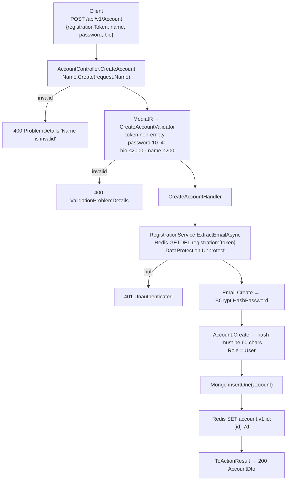
```mermaid
flowchart TD
    A["Client<br/>POST /api/v1/Account<br/>{registrationToken, name, password, bio}"] --> B["AccountController.CreateAccount<br/>Name.Create(request.Name)"]
    B -->|invalid| B1["400 ProblemDetails 'Name is invalid'"]
    B --> C["MediatR → CreateAccountValidator<br/>token non-empty · password 10–40<br/>bio ≤2000 · name ≤200"]
    C -->|invalid| C1["400 ValidationProblemDetails"]
    C --> D["CreateAccountHandler"]
    D --> E["RegistrationService.ExtractEmailAsync<br/>Redis GETDEL registration:{token}<br/>DataProtection.Unprotect"]
    E -->|null| E1["401 Unauthenticated"]
    E --> F["Email.Create → BCrypt.HashPassword"]
    F --> G["Account.Create — hash must be 60 chars<br/>Role = User"]
    G --> H["Mongo insertOne(account)"]
    H --> I["Redis SET account:v1:id:{id} 7d"]
    I --> J["ToActionResult → 200 AccountDto"]
```
The email comes from the token, never the body. Duplicate emails are caught only by the partial
unique index, which surfaces as a 500.

### 2. Get my account — `GET /Account/me`

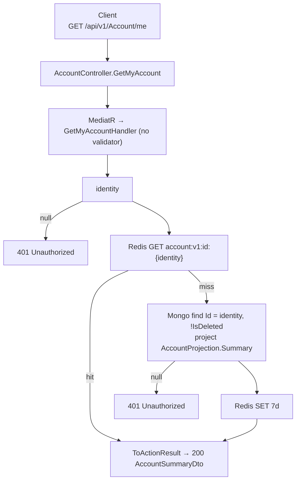
```mermaid
flowchart TD
    A["Client<br/>GET /api/v1/Account/me"] --> B["AccountController.GetMyAccount"]
    B --> C["MediatR → GetMyAccountHandler (no validator)"]
    C --> D["identity"] -->|null| D1["401 Unauthorized"]
    D --> E["Redis GET account:v1:id:{identity}"]
    E -->|hit| Z["ToActionResult → 200 AccountSummaryDto"]
    E -->|miss| F["Mongo find Id = identity, !IsDeleted<br/>project AccountProjection.Summary"]
    F -->|null| F1["401 Unauthorized"]
    F --> G["Redis SET 7d"] --> Z
```
`AccountProjection.Summary` = `Name, Avatars, Bio, FollowerAmount, FollowingAmount`; password and
email never reach the DTO.

### 3. Change name — `PUT /Account/me/name`

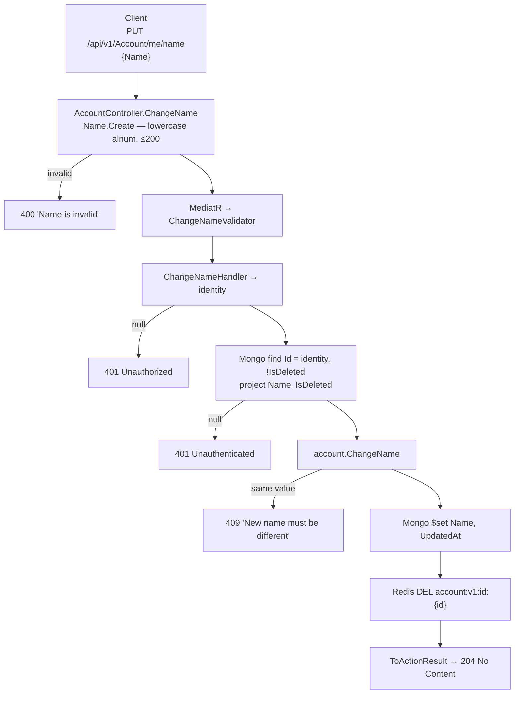
```mermaid
flowchart TD
    A["Client<br/>PUT /api/v1/Account/me/name<br/>{Name}"] --> B["AccountController.ChangeName<br/>Name.Create — lowercase alnum, ≤200"]
    B -->|invalid| B1["400 'Name is invalid'"]
    B --> C["MediatR → ChangeNameValidator"] --> D["ChangeNameHandler → identity"]
    D -->|null| D1["401 Unauthorized"]
    D --> E["Mongo find Id = identity, !IsDeleted<br/>project Name, IsDeleted"]
    E -->|null| E1["401 Unauthenticated"]
    E --> F["account.ChangeName"]
    F -->|"same value"| F1["409 'New name must be different'"]
    F --> G["Mongo $set Name, UpdatedAt"]
    G --> H["Redis DEL account:v1:id:{id}"] --> I["ToActionResult → 204 No Content"]
```

### 4. Change bio — `PUT /Account/me/bio`

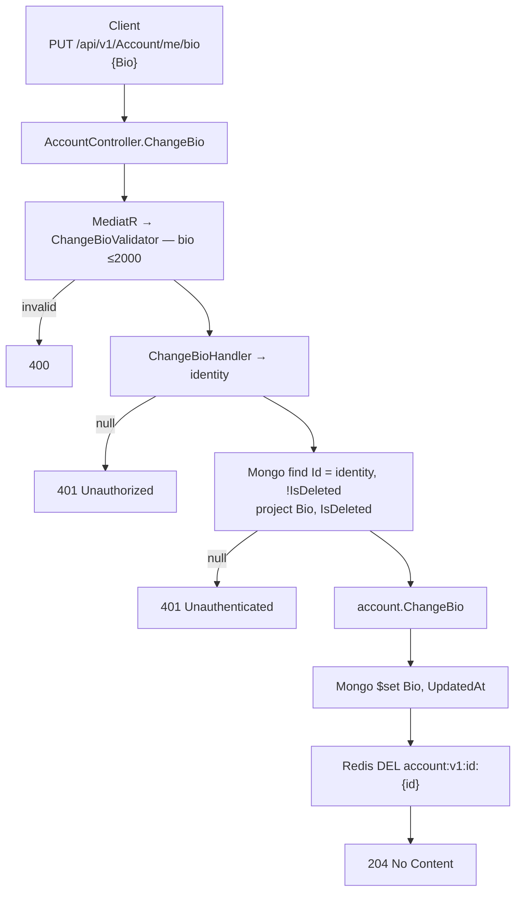
```mermaid
flowchart TD
    A["Client<br/>PUT /api/v1/Account/me/bio<br/>{Bio}"] --> B["AccountController.ChangeBio"]
    B --> C["MediatR → ChangeBioValidator — bio ≤2000"] -->|invalid| C1["400"]
    C --> D["ChangeBioHandler → identity"] -->|null| D1["401 Unauthorized"]
    D --> E["Mongo find Id = identity, !IsDeleted<br/>project Bio, IsDeleted"]
    E -->|null| E1["401 Unauthenticated"]
    E --> F["account.ChangeBio"] --> G["Mongo $set Bio, UpdatedAt"]
    G --> H["Redis DEL account:v1:id:{id}"] --> I["204 No Content"]
```
Bio carries no "must be different" rule, so resubmitting the same value succeeds.

### 5. Change password — `PUT /Account/me/password`

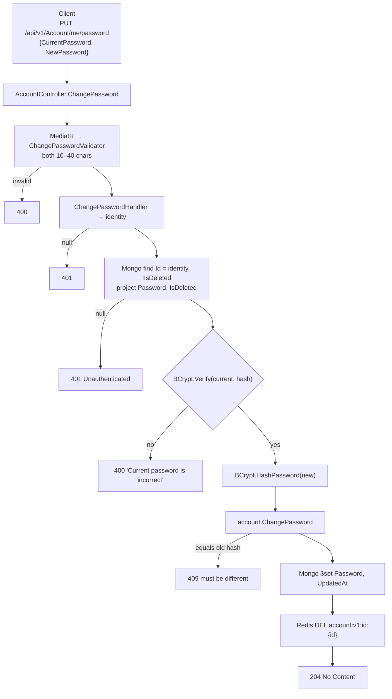
```mermaid
flowchart TD
    A["Client<br/>PUT /api/v1/Account/me/password<br/>{CurrentPassword, NewPassword}"] --> B["AccountController.ChangePassword"]
    B --> C["MediatR → ChangePasswordValidator<br/>both 10–40 chars"] -->|invalid| C1["400"]
    C --> D["ChangePasswordHandler → identity"] -->|null| D1["401"]
    D --> E["Mongo find Id = identity, !IsDeleted<br/>project Password, IsDeleted"]
    E -->|null| E1["401 Unauthenticated"]
    E --> F{"BCrypt.Verify(current, hash)"}
    F -->|no| F1["400 'Current password is incorrect'"]
    F -->|yes| G["BCrypt.HashPassword(new)"]
    G --> H["account.ChangePassword"] -->|"equals old hash"| H1["409 must be different"]
    H --> I["Mongo $set Password, UpdatedAt"]
    I --> J["Redis DEL account:v1:id:{id}"] --> K["204 No Content"]
```
Existing refresh tokens survive a password change.

### 6. Change email — `PUT /Account/me/email`

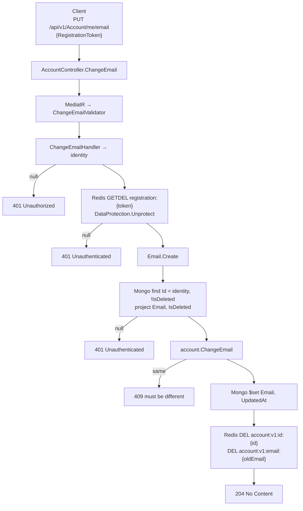
```mermaid
flowchart TD
    A["Client<br/>PUT /api/v1/Account/me/email<br/>{RegistrationToken}"] --> B["AccountController.ChangeEmail"]
    B --> C["MediatR → ChangeEmailValidator"] --> D["ChangeEmailHandler → identity"]
    D -->|null| D1["401 Unauthorized"]
    D --> E["Redis GETDEL registration:{token}<br/>DataProtection.Unprotect"]
    E -->|null| E1["401 Unauthenticated"]
    E --> F["Email.Create"] --> G["Mongo find Id = identity, !IsDeleted<br/>project Email, IsDeleted"]
    G -->|null| G1["401 Unauthenticated"]
    G --> H["account.ChangeEmail"] -->|"same"| H1["409 must be different"]
    H --> I["Mongo $set Email, UpdatedAt"]
    I --> J["Redis DEL account:v1:id:{id}<br/>DEL account:v1:email:{oldEmail}"] --> K["204 No Content"]
```
The new address is proven beforehand via `/Email/send-for-verify` + `/Email/verify`.

### 7. Change avatar — `POST /Account/me/avatar` `[upload]`

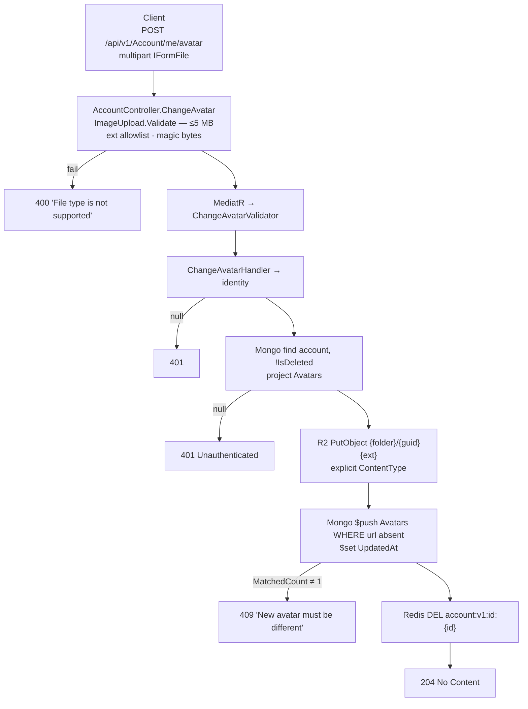
```mermaid
flowchart TD
    A["Client<br/>POST /api/v1/Account/me/avatar<br/>multipart IFormFile"] --> B["AccountController.ChangeAvatar<br/>ImageUpload.Validate — ≤5 MB<br/>ext allowlist · magic bytes"]
    B -->|fail| B1["400 'File type is not supported'"]
    B --> C["MediatR → ChangeAvatarValidator"] --> D["ChangeAvatarHandler → identity"]
    D -->|null| D1["401"]
    D --> E["Mongo find account, !IsDeleted<br/>project Avatars"] -->|null| E1["401 Unauthenticated"]
    E --> F["R2 PutObject {folder}/{guid}{ext}<br/>explicit ContentType"]
    F --> G["Mongo $push Avatars WHERE url absent<br/>$set UpdatedAt"]
    G -->|"MatchedCount ≠ 1"| G1["409 'New avatar must be different'"]
    G --> H["Redis DEL account:v1:id:{id}"] --> I["204 No Content"]
```
The upload precedes the write, so a rejected duplicate leaves an orphan R2 object.

### 8. Remove avatar — `DELETE /Account/me/avatar?url=`

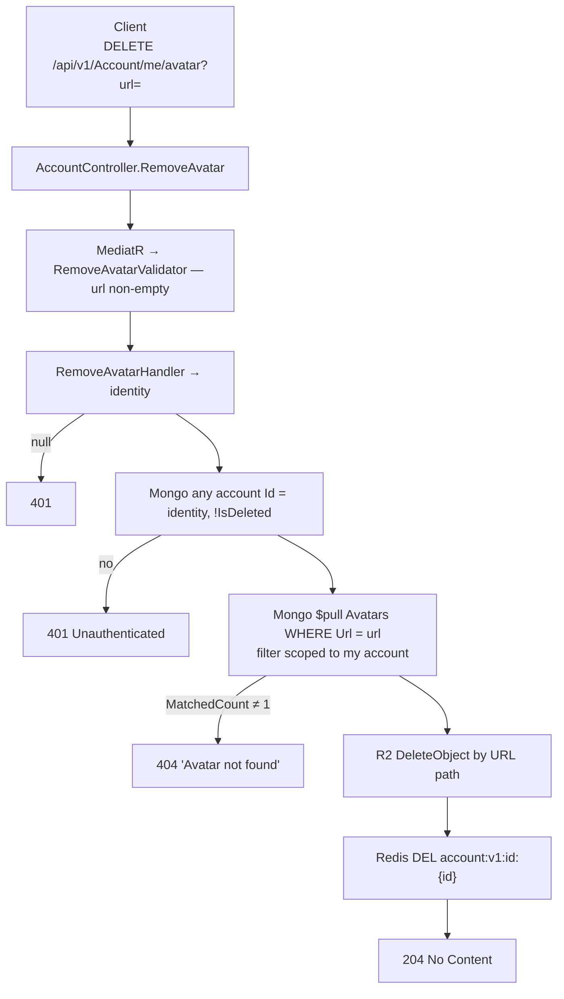
```mermaid
flowchart TD
    A["Client<br/>DELETE /api/v1/Account/me/avatar?url="] --> B["AccountController.RemoveAvatar"]
    B --> C["MediatR → RemoveAvatarValidator — url non-empty"] --> D["RemoveAvatarHandler → identity"]
    D -->|null| D1["401"]
    D --> E["Mongo any account Id = identity, !IsDeleted"] -->|no| E1["401 Unauthenticated"]
    E --> F["Mongo $pull Avatars WHERE Url = url<br/>filter scoped to my account"]
    F -->|"MatchedCount ≠ 1"| F1["404 'Avatar not found'"]
    F --> G["R2 DeleteObject by URL path"]
    G --> H["Redis DEL account:v1:id:{id}"] --> I["204 No Content"]
```
Ownership is proven by the filter before the R2 delete, so an arbitrary URL cannot remove another
account's object.

### 9. Delete account — `DELETE /Account/me`

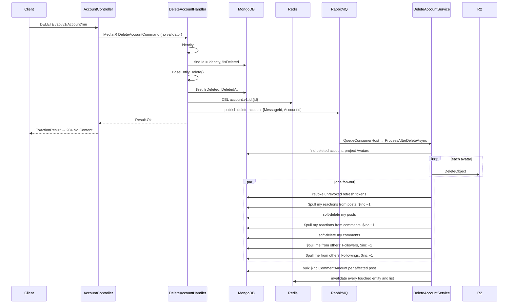
```mermaid
sequenceDiagram
    participant C as Client
    participant Ctl as AccountController
    participant H as DeleteAccountHandler
    participant M as MongoDB
    participant R as Redis
    participant Q as RabbitMQ
    participant S as DeleteAccountService
    participant R2 as R2

    C->>Ctl: DELETE /api/v1/Account/me
    Ctl->>H: MediatR DeleteAccountCommand (no validator)
    H->>H: identity
    H->>M: find Id = identity, !IsDeleted
    H->>H: BaseEntity.Delete()
    H->>M: $set IsDeleted, DeletedAt
    H->>R: DEL account:v1:id:{id}
    H->>Q: publish delete-account {MessageId, AccountId}
    H-->>Ctl: Result.Ok
    Ctl-->>C: ToActionResult → 204 No Content

    Q->>S: QueueConsumerHost → ProcessAfterDeleteAsync
    S->>M: find deleted account, project Avatars
    loop each avatar
        S->>R2: DeleteObject
    end
    par one fan-out
        S->>M: revoke unrevoked refresh tokens
        S->>M: $pull my reactions from posts, $inc −1
        S->>M: soft-delete my posts
        S->>M: $pull my reactions from comments, $inc −1
        S->>M: soft-delete my comments
        S->>M: $pull me from others' Followers, $inc −1
        S->>M: $pull me from others' Followings, $inc −1
    end
    S->>M: bulk $inc CommentAmount per affected post
    S->>R: invalidate every touched entity and list
```
The only command without a validator. The cascade is retry-safe: each `$pull` + `$inc` is guarded by
an `ElemMatch` that stops matching once applied.

### 10. Recover account — `POST /Account/recover` · **anon** `[auth]`

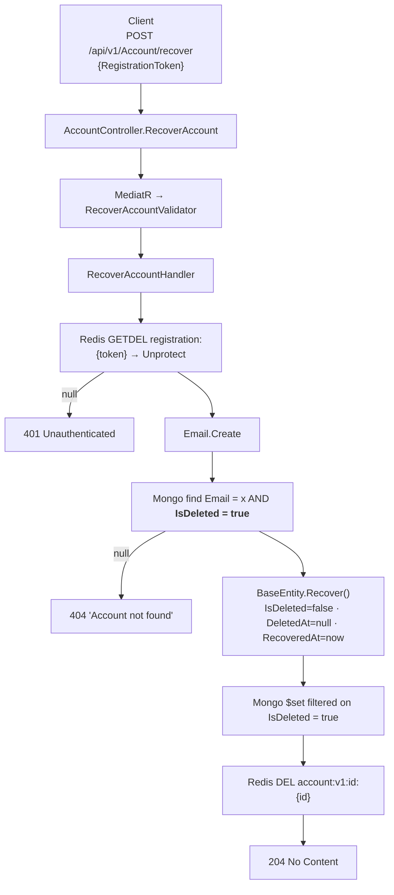
```mermaid
flowchart TD
    A["Client<br/>POST /api/v1/Account/recover<br/>{RegistrationToken}"] --> B["AccountController.RecoverAccount"]
    B --> C["MediatR → RecoverAccountValidator"] --> D["RecoverAccountHandler"]
    D --> E["Redis GETDEL registration:{token} → Unprotect"]
    E -->|null| E1["401 Unauthenticated"]
    E --> F["Email.Create"]
    F --> G["Mongo find Email = x AND <b>IsDeleted = true</b>"]
    G -->|null| G1["404 'Account not found'"]
    G --> H["BaseEntity.Recover()<br/>IsDeleted=false · DeletedAt=null · RecoveredAt=now"]
    H --> I["Mongo $set filtered on IsDeleted = true"]
    I --> J["Redis DEL account:v1:id:{id}"] --> K["204 No Content"]
```
The only query in the system searching for `IsDeleted == true`. It restores the account row; content
removed by the `delete-account` cascade stays gone.

### 11. Reset password — `PUT /Account/reset-password` · **anon** `[auth]`

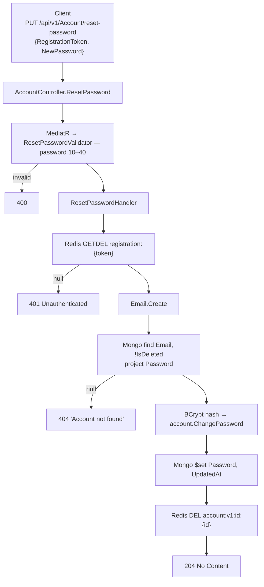
```mermaid
flowchart TD
    A["Client<br/>PUT /api/v1/Account/reset-password<br/>{RegistrationToken, NewPassword}"] --> B["AccountController.ResetPassword"]
    B --> C["MediatR → ResetPasswordValidator — password 10–40"] -->|invalid| C1["400"]
    C --> D["ResetPasswordHandler"]
    D --> E["Redis GETDEL registration:{token}"] -->|null| E1["401 Unauthenticated"]
    E --> F["Email.Create"] --> G["Mongo find Email, !IsDeleted<br/>project Password"]
    G -->|null| G1["404 'Account not found'"]
    G --> H["BCrypt hash → account.ChangePassword"]
    H --> I["Mongo $set Password, UpdatedAt"]
    I --> J["Redis DEL account:v1:id:{id}"] --> K["204 No Content"]
```

### 12. List accounts — `GET /Account` · **admin**

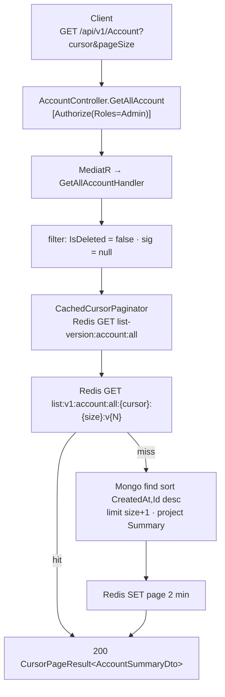
```mermaid
flowchart TD
    A["Client<br/>GET /api/v1/Account?cursor&pageSize"] --> B["AccountController.GetAllAccount<br/>[Authorize(Roles=Admin)]"]
    B --> C["MediatR → GetAllAccountHandler"]
    C --> D["filter: IsDeleted = false · sig = null"]
    D --> E["CachedCursorPaginator<br/>Redis GET list-version:account:all"]
    E --> F["Redis GET list:v1:account:all:{cursor}:{size}:v{N}"]
    F -->|hit| Z["200 CursorPageResult&lt;AccountSummaryDto&gt;"]
    F -->|miss| G["Mongo find sort CreatedAt,Id desc<br/>limit size+1 · project Summary"]
    G --> H["Redis SET page 2 min"] --> Z
```

### 13. Get account by id — `GET /Account/{accountId}`

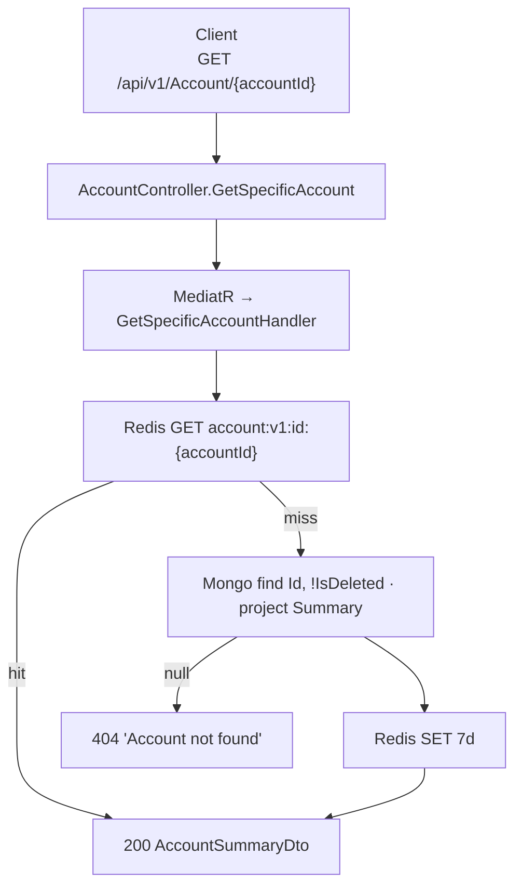
```mermaid
flowchart TD
    A["Client<br/>GET /api/v1/Account/{accountId}"] --> B["AccountController.GetSpecificAccount"]
    B --> C["MediatR → GetSpecificAccountHandler"]
    C --> D["Redis GET account:v1:id:{accountId}"]
    D -->|hit| Z["200 AccountSummaryDto"]
    D -->|miss| E["Mongo find Id, !IsDeleted · project Summary"]
    E -->|null| E1["404 'Account not found'"]
    E --> F["Redis SET 7d"] --> Z
```
Any authenticated caller may read any account summary.

### 14. Get account by email — `GET /Account/by-email?email=` · **admin**

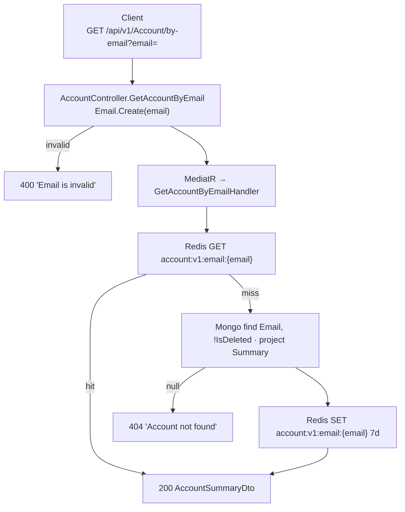
```mermaid
flowchart TD
    A["Client<br/>GET /api/v1/Account/by-email?email="] --> B["AccountController.GetAccountByEmail<br/>Email.Create(email)"]
    B -->|invalid| B1["400 'Email is invalid'"]
    B --> C["MediatR → GetAccountByEmailHandler"]
    C --> D["Redis GET account:v1:email:{email}"]
    D -->|hit| Z["200 AccountSummaryDto"]
    D -->|miss| E["Mongo find Email, !IsDeleted · project Summary"]
    E -->|null| E1["404 'Account not found'"]
    E --> F["Redis SET account:v1:email:{email} 7d"] --> Z
```
The only consumer of the `account:v1:email:*` key, invalidated on email change (#6).

### 15. Get accounts by name — `GET /Account/by-name?name=`

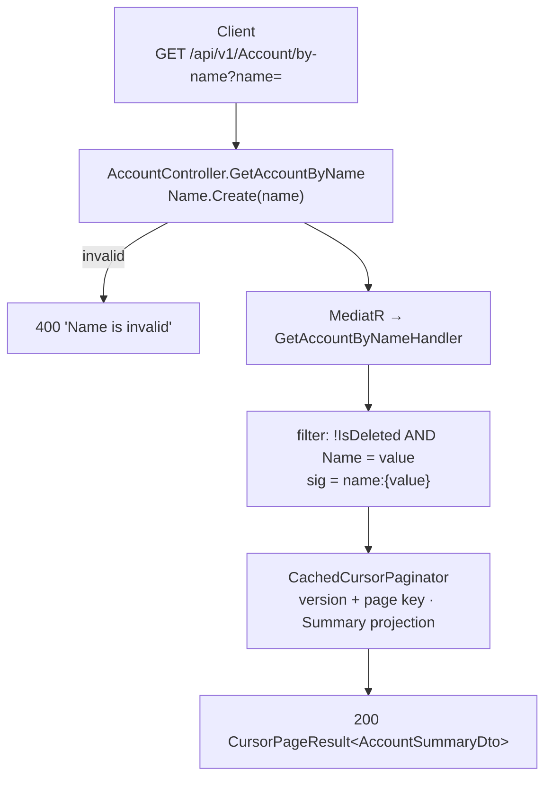
```mermaid
flowchart TD
    A["Client<br/>GET /api/v1/Account/by-name?name="] --> B["AccountController.GetAccountByName<br/>Name.Create(name)"]
    B -->|invalid| B1["400 'Name is invalid'"]
    B --> C["MediatR → GetAccountByNameHandler"]
    C --> D["filter: !IsDeleted AND Name = value<br/>sig = name:{value}"]
    D --> E["CachedCursorPaginator<br/>version + page key · Summary projection"]
    E --> F["200 CursorPageResult&lt;AccountSummaryDto&gt;"]
```
Exact match on the value object, not a prefix search.

### 16. Search accounts — `GET /Account/search?keyword=` `[search]`

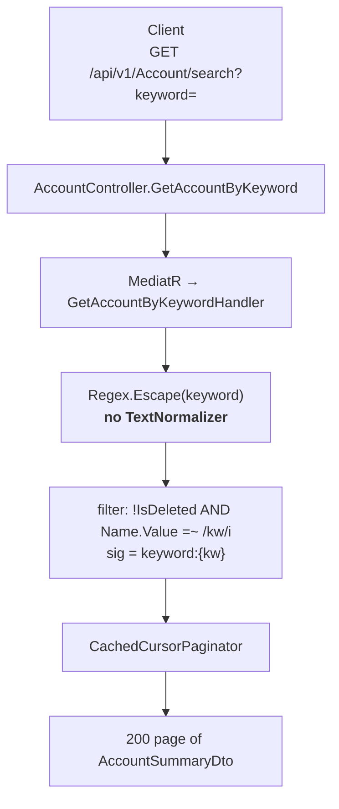
```mermaid
flowchart TD
    A["Client<br/>GET /api/v1/Account/search?keyword="] --> B["AccountController.GetAccountByKeyword"]
    B --> C["MediatR → GetAccountByKeywordHandler"]
    C --> D["Regex.Escape(keyword)<br/><b>no TextNormalizer</b>"]
    D --> E["filter: !IsDeleted AND Name.Value =~ /kw/i<br/>sig = keyword:{kw}"]
    E --> F["CachedCursorPaginator"] --> G["200 page of AccountSummaryDto"]
```
Post and shop search normalize the keyword first; this one does not. Stored names are already
lowercase alphanumeric, so an accented keyword never matches.

---

## Auth

### 17. Login — `POST /Auth/login` · **anon** `[auth]`

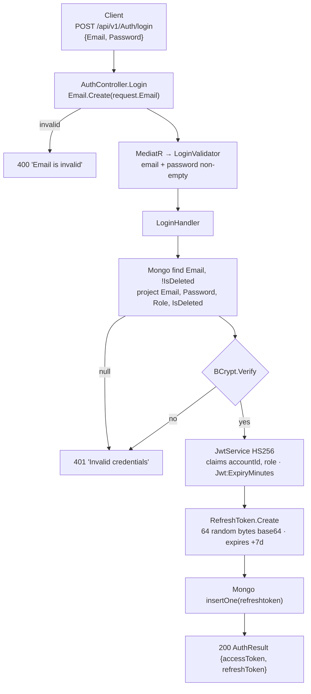
```mermaid
flowchart TD
    A["Client<br/>POST /api/v1/Auth/login<br/>{Email, Password}"] --> B["AuthController.Login<br/>Email.Create(request.Email)"]
    B -->|invalid| B1["400 'Email is invalid'"]
    B --> C["MediatR → LoginValidator<br/>email + password non-empty"] --> D["LoginHandler"]
    D --> E["Mongo find Email, !IsDeleted<br/>project Email, Password, Role, IsDeleted"]
    E -->|null| X["401 'Invalid credentials'"]
    E --> F{"BCrypt.Verify"}
    F -->|no| X
    F -->|yes| G["JwtService HS256<br/>claims accountId, role · Jwt:ExpiryMinutes"]
    G --> H["RefreshToken.Create<br/>64 random bytes base64 · expires +7d"]
    H --> I["Mongo insertOne(refreshtoken)"]
    I --> J["200 AuthResult {accessToken, refreshToken}"]
```
Both failure modes share one message, so account existence is not disclosed. Prior refresh tokens
remain valid.

### 18. Refresh — `POST /Auth/refresh` · **anon** `[auth]`

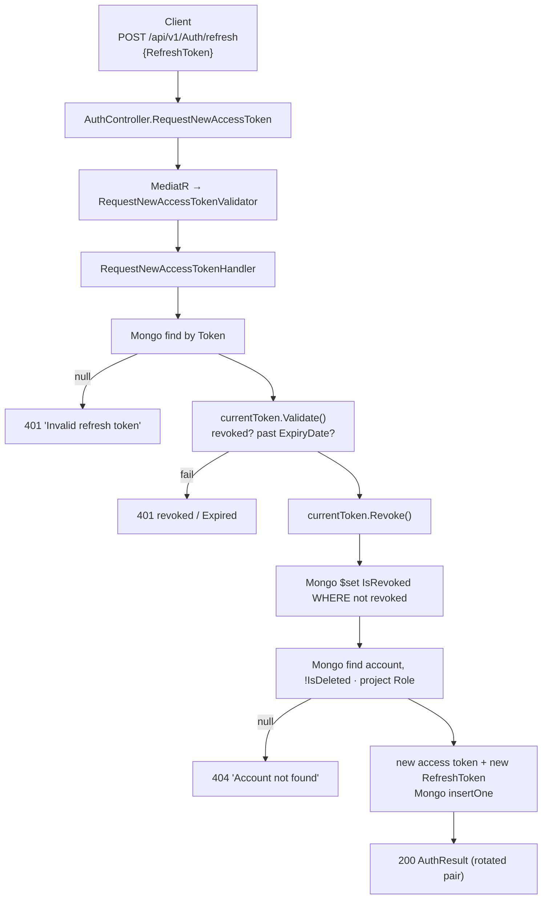
```mermaid
flowchart TD
    A["Client<br/>POST /api/v1/Auth/refresh<br/>{RefreshToken}"] --> B["AuthController.RequestNewAccessToken"]
    B --> C["MediatR → RequestNewAccessTokenValidator"] --> D["RequestNewAccessTokenHandler"]
    D --> E["Mongo find by Token"] -->|null| E1["401 'Invalid refresh token'"]
    E --> F["currentToken.Validate()<br/>revoked? past ExpiryDate?"]
    F -->|fail| F1["401 revoked / Expired"]
    F --> G["currentToken.Revoke()"]
    G --> H["Mongo $set IsRevoked WHERE not revoked"]
    H --> I["Mongo find account, !IsDeleted · project Role"]
    I -->|null| I1["404 'Account not found'"]
    I --> J["new access token + new RefreshToken<br/>Mongo insertOne"]
    J --> K["200 AuthResult (rotated pair)"]
```
Single-use rotation; a replayed revoked token returns 401 without invalidating the family. A TTL
index on `ExpiryDate` purges expired rows.

### 19. List refresh tokens — `GET /Auth/refresh-token` · **admin**

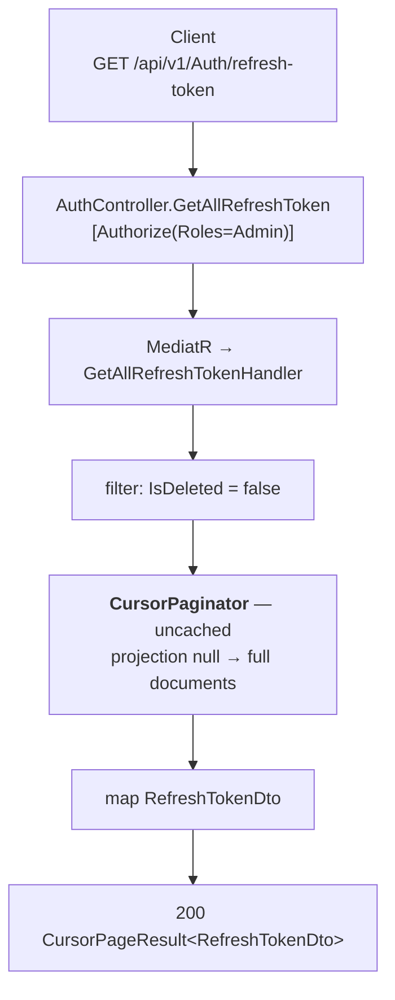
```mermaid
flowchart TD
    A["Client<br/>GET /api/v1/Auth/refresh-token"] --> B["AuthController.GetAllRefreshToken<br/>[Authorize(Roles=Admin)]"]
    B --> C["MediatR → GetAllRefreshTokenHandler"]
    C --> D["filter: IsDeleted = false"]
    D --> E["<b>CursorPaginator</b> — uncached<br/>projection null → full documents"]
    E --> F["map RefreshTokenDto"] --> G["200 CursorPageResult&lt;RefreshTokenDto&gt;"]
```
The only uncached list endpoint and the only one reading whole documents — appropriate for a
security-audit view.

### 20. Get refresh token — `GET /Auth/refresh-token/{id}` · **admin**

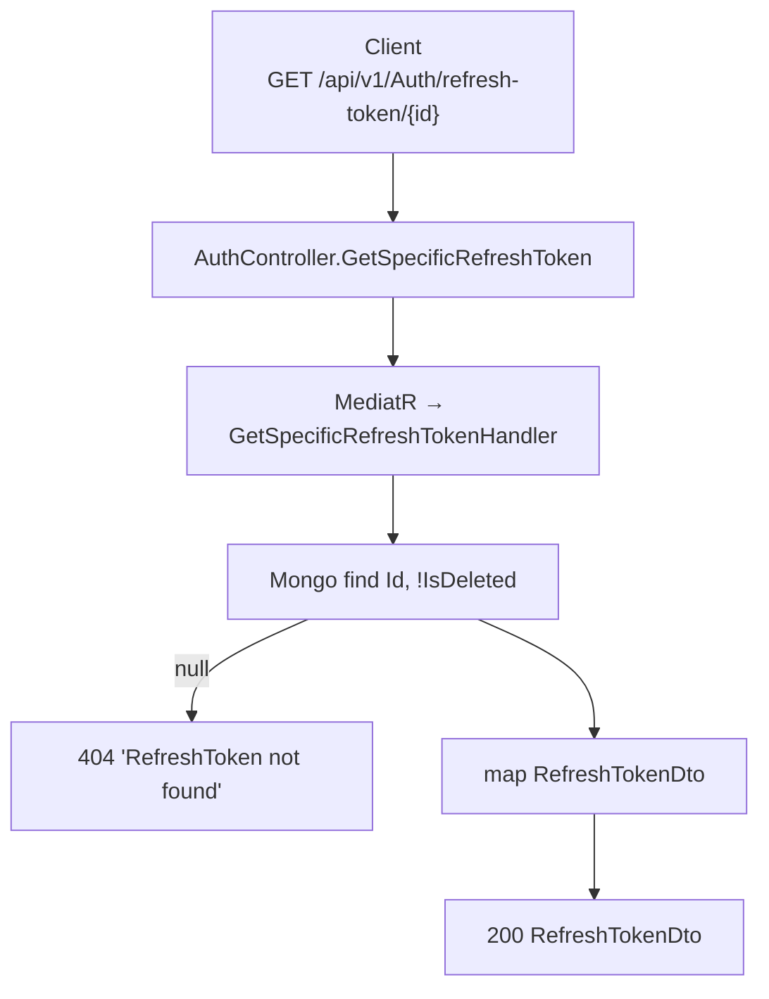
```mermaid
flowchart TD
    A["Client<br/>GET /api/v1/Auth/refresh-token/{id}"] --> B["AuthController.GetSpecificRefreshToken"]
    B --> C["MediatR → GetSpecificRefreshTokenHandler"]
    C --> D["Mongo find Id, !IsDeleted"]
    D -->|null| D1["404 'RefreshToken not found'"]
    D --> E["map RefreshTokenDto"] --> F["200 RefreshTokenDto"]
```

---

## Email

### 21. Send registration OTP — `POST /Email/send-for-register` · **anon** `[email]`

```mermaid
flowchart TD
    A["Client<br/>POST /api/v1/Email/send-for-register<br/>{Email}"] --> B["EmailController.SendForRegister<br/>Email.Create"]
    B -->|invalid| B1["400"]
    B --> C["MediatR → SendEmailForRegisterValidator<br/>EmailAddress()"] --> D["SendEmailForRegisterHandler"]
    D --> E{"Mongo any account Email = x<br/><b>AND !IsDeleted</b>"}
    E -->|yes| E1["409 'Email already exists'"]
    E -->|no| F["OtpService.GenerateAsync<br/>RandomNumberGenerator 6 digits"]
    F --> G["Redis SET otp:{email} 10 min<br/>{Code, Attempts:0, ExpiresAt}"]
    G --> H["Resend POST /emails · HttpClient 10 s timeout"]
    H --> I["204 No Content"]
```

### 22. Send verification OTP — `POST /Email/send-for-verify` · **anon** `[email]`

```mermaid
flowchart TD
    A["Client<br/>POST /api/v1/Email/send-for-verify<br/>{Email}"] --> B["EmailController.SendForVerify<br/>Email.Create"]
    B --> C["MediatR → SendEmailForVerifyValidator"] --> D["SendEmailForVerifyHandler"]
    D --> E{"Mongo any account Email = x<br/><b>no IsDeleted filter</b>"}
    E -->|no| E1["404 'Email not found'"]
    E -->|yes| F["OtpService.GenerateAsync"]
    F --> G["Redis SET otp:{email} 10 min"]
    G --> H["Resend POST /emails"] --> I["204 No Content"]
```
Deliberately omits `!IsDeleted` so a soft-deleted account can obtain a token for `/Account/recover`.
Note the asymmetry with #21.

### 23. Verify OTP — `POST /Email/verify` · **anon** `[email]`

```mermaid
flowchart TD
    A["Client<br/>POST /api/v1/Email/verify<br/>{Email, Otp}"] --> B["EmailController.Verify<br/>Email.Create"]
    B --> C["MediatR → VerifyEmailValidator — otp exactly 6 chars"] -->|invalid| C1["400"]
    C --> D["VerifyEmailHandler → OtpService.VerifyAsync"]
    D --> E["Redis GETDEL otp:{email}"]
    E -->|"missing / expired"| E1["400 'Otp is incorrect'"]
    E --> F{"entry.Code == otp?"}
    F -->|no| G["attempts+1 · Redis re-SET<br/>only while attempts &lt; 3"] --> E1
    F -->|yes| H["RegistrationService.GenerateTokenAsync<br/>32 random bytes base64url"]
    H --> I["Redis SET registration:{token}<br/>= Protect(email) 10 min"]
    I --> J["200 registrationToken (string)"]
```
`GETDEL` followed by a conditional re-`SET` is not atomic. The returned token is the credential for
#1, #6, #10 and #11.

---

## Post

### 24. Create post — `POST /Post` `[upload]`

```mermaid
flowchart TD
    A["Client<br/>POST /api/v1/Post (multipart)<br/>shopName, shopAddress, caption, rate, images"] --> B["PostController.CreatePost<br/>Amount.Create(rate) ≥ 0"]
    B -->|invalid| B1["400"]
    B --> C["ImageUpload.Validate<br/>≤10 files · ≤5 MB · allowlist + magic bytes"]
    C -->|fail| C1["400"]
    C --> D["MediatR → CreatePostValidator<br/>rate 1–5 · names ≤200"] -->|invalid| D1["400"]
    D --> E["CreatePostHandler → identity"] -->|null| E1["401"]
    E --> F["R2 PutObject per image"]
    F --> G{"Mongo find Shop<br/>Name = x AND Address = y AND !IsDeleted"}
    G -->|found| H["shopId = existing.Id"]
    G -->|none| I["Shop.Create → insertOne<br/>Redis SET shop 7d<br/>bump shop:all, shop:mostRated"] --> H
    H --> J["Post.Create — CaptionNormalized computed"]
    J --> K["Mongo insertOne(post)"]
    K --> L["Redis SET post:v1:id 7d<br/>bump post:all, post:account:{me},<br/>post:shop:{id}, post:mostReacted"]
    L --> M["RabbitMQ publish recalculate-shop-rate"]
    M --> N["200 PostDto"]
    M -.-> O["ShopRateService: average live post rates<br/>$set Shop.Rate · bump shop lists"]
```
Shop matching uses the raw name and address, not the normalized fields, so "Cafe X" and "cafe x"
create two shops.

### 25. Change caption — `PUT /Post/{postId}/caption`

```mermaid
flowchart TD
    A["Client<br/>PUT /api/v1/Post/{postId}/caption<br/>{Caption}"] --> B["PostController.ChangeCaption"]
    B --> C["MediatR → ChangeCaptionValidator"] --> D["ChangeCaptionHandler → identity"]
    D -->|null| D1["401"]
    D --> E["Mongo find Id AND <b>AccountId = me</b> AND !IsDeleted<br/>project Caption, ShopId"]
    E -->|null| E1["404 'Post not found'<br/>(also when not the owner)"]
    E --> F["post.ChangeCaption — recomputes CaptionNormalized"]
    F --> G["Mongo $set Caption, CaptionNormalized, UpdatedAt"]
    G --> H["Redis DEL post:v1:id<br/>bump post:all, post:account:{me},<br/>post:shop:{id}, post:mostReacted"]
    H --> I["204 No Content"]
```

### 26. Change rate — `PUT /Post/{postId}/rate`

```mermaid
flowchart TD
    A["Client<br/>PUT /api/v1/Post/{postId}/rate<br/>{Rate}"] --> B["PostController.ChangeRate<br/>Amount.Create(rate)"]
    B -->|invalid| B1["400"]
    B --> C["MediatR → ChangeRateValidator — rate 1–5"] -->|invalid| C1["400 'Rate must be between 1 and 5'"]
    C --> D["ChangeRateHandler → identity"] -->|null| D1["401"]
    D --> E["Mongo find Id AND AccountId = me AND !IsDeleted<br/>project ShopId, Rate"]
    E -->|null| E1["404 'Post not found'"]
    E --> F["post.ChangeRate → Mongo $set Rate, UpdatedAt"]
    F --> G["Redis DEL post cache · bump 4 post lists"]
    G --> H["RabbitMQ publish recalculate-shop-rate"] --> I["204 No Content"]
    H -.-> J["ShopRateService recomputes Shop.Rate"]
```

### 27. Delete post — `DELETE /Post/{postId}`

```mermaid
sequenceDiagram
    participant C as Client
    participant Ctl as PostController
    participant H as DeletePostHandler
    participant M as MongoDB
    participant R2 as R2
    participant R as Redis
    participant Q as RabbitMQ
    participant S as DeletePostService

    C->>Ctl: DELETE /api/v1/Post/{postId}
    Ctl->>H: MediatR → DeletePostValidator → handler
    H->>H: identity
    H->>M: find Id AND AccountId = me AND !IsDeleted
    H->>M: $set IsDeleted, DeletedAt
    loop each post image
        H->>R2: DeleteObject
    end
    H->>R: DEL post cache, bump 4 post lists
    H->>Q: publish recalculate-shop-rate
    H->>Q: publish delete-post
    H-->>Ctl: Result.Ok
    Ctl-->>C: 204 No Content
    Q->>S: ProcessAfterDeleteAsync
    S->>M: find non-deleted comments on the post
    loop each comment image
        S->>R2: DeleteObject
    end
    S->>M: soft-delete those comments
    S->>R: DEL each comment cache, bump comment:post:{id}<br/>and comment:account:{author} per distinct author
```
`Post.CommentAmount` is not reset; the shop rate is recomputed from remaining live posts.

### 28. Get post — `GET /Post/{postId}`

```mermaid
flowchart TD
    A["Client<br/>GET /api/v1/Post/{postId}"] --> B["PostController.GetSpecificPost"]
    B --> C["MediatR → GetSpecificPostHandler → identity"]
    C -->|null| C1["401"]
    C --> D["Redis GET post:v1:id:{postId}"]
    D -->|hit| G["PostFeedEnricher"]
    D -->|miss| E["Mongo find Id, !IsDeleted<br/>project PostProjection.Summary"]
    E -->|null| E1["404 'Post not found'"]
    E --> F["Redis SET 7d"] --> G
    G --> H["Mongo ReactionMembership — reacted?<br/>Mongo SaveMembership — saved?"]
    H --> I["200 PostFeedItemDto {Post, IsReacted, IsSaved}"]
```
The two membership reads are per-viewer and never cached.

### 29. My posts — `GET /Post/mine`

```mermaid
flowchart TD
    A["Client<br/>GET /api/v1/Post/mine?cursor&pageSize"] --> B["PostController.GetMyPost"]
    B --> C["MediatR → GetMyPostHandler → identity"] -->|null| C1["401"]
    C --> D["filter: AccountId = me, !IsDeleted<br/>sig = account:{me}"]
    D --> E["CachedCursorPaginator<br/>version + page key · Summary"]
    E --> F["200 CursorPageResult&lt;PostSummaryDto&gt;"]
```
Returns bare `PostSummaryDto` — no enrichment, unlike #28/#32/#33/#34.

### 30. Posts by account — `GET /Post/account/{accountId}`

```mermaid
flowchart TD
    A["Client<br/>GET /api/v1/Post/account/{accountId}"] --> B["PostController.GetPostByAccount"]
    B --> C["MediatR → GetPostByAccountHandler"]
    C --> D["filter: AccountId = x, !IsDeleted<br/>sig = account:{x}"]
    D --> E["CachedCursorPaginator · Summary"] --> F["200 page of PostSummaryDto"]
```
No check that the target account exists or is live.

### 31. Posts by shop — `GET /Post/shop/{shopId}`

```mermaid
flowchart TD
    A["Client<br/>GET /api/v1/Post/shop/{shopId}"] --> B["PostController.GetPostByShop"]
    B --> C["MediatR → GetPostByShopHandler"]
    C --> D["filter: ShopId = x, !IsDeleted<br/>sig = shop:{x}"]
    D --> E["CachedCursorPaginator · Summary"] --> F["200 page of PostSummaryDto"]
```

### 32. Search posts — `GET /Post/search?keyword=` `[search]`

```mermaid
flowchart TD
    A["Client<br/>GET /api/v1/Post/search?keyword="] --> B["PostController.GetPostByKeyword"]
    B --> C["MediatR → GetPostByKeywordHandler → identity"] -->|null| C1["401"]
    C --> D["TextNormalizer.RemoveDiacriticsAndLower<br/>then Regex.Escape"]
    D --> E["filter: !IsDeleted AND<br/>CaptionNormalized =~ /kw/i<br/>sig = keyword:{kw}"]
    E --> F["CachedCursorPaginator"] --> G["PostFeedEnricher · +2 Mongo reads"]
    G --> H["200 page of PostFeedItemDto"]
```
No write path bumps a `keyword:*` version, so these pages refresh only on the 2-minute TTL.

### 33. Latest posts — `GET /Post/latest`

```mermaid
flowchart TD
    A["Client<br/>GET /api/v1/Post/latest?cursor&pageSize"] --> B["PostController.GetLatestPost"]
    B --> C["MediatR → GetLatestPostHandler → identity"] -->|null| C1["401"]
    C --> D["filter: IsDeleted = false · sig = null"]
    D --> E["CachedCursorPaginator<br/>Redis GET list-version:post:all → page key<br/>Mongo sort CreatedAt,Id desc limit size+1"]
    E --> F["PostFeedEnricher"] --> G["200 page of PostFeedItemDto"]
```

### 34. Most-reacted posts — `GET /Post/most-reacted`

```mermaid
flowchart TD
    A["Client<br/>GET /api/v1/Post/most-reacted"] --> B["PostController.GetMostReactedPost"]
    B --> C["MediatR → GetMostReactedPostHandler → identity"] -->|null| C1["401"]
    C --> D["ListCache.VersionAsync(post, mostReacted)<br/>build page key by hand"]
    D --> E["Redis GET page key"]
    E -->|hit| H["PostFeedEnricher"]
    E -->|miss| F["Mongo find !IsDeleted<br/>sort ReactionAmount, CreatedAt, Id desc<br/>limit pageSize (no +1) · Summary"]
    F --> G["Redis SET 2 min<br/>NextCursor = null · HasMore = false"] --> H
    H --> I["200 page of PostFeedItemDto"]
```
Builds its cache key manually and always returns the first page, so the `cursor` parameter has no
effect.

---

## Comment

### 35. Create comment — `POST /Comment` `[upload]`

```mermaid
sequenceDiagram
    participant C as Client
    participant Ctl as CommentController
    participant H as CreateCommentHandler
    participant R2 as R2
    participant M as MongoDB
    participant R as Redis
    participant Q as RabbitMQ
    participant S as CommentService
    participant N as NotificationService

    C->>Ctl: POST /api/v1/Comment (postId, content, images)
    Ctl->>H: MediatR → CreateCommentValidator → handler
    H->>H: identity
    loop each image
        H->>R2: PutObject
    end
    H->>H: Comment.Create — content ≤2000
    H->>M: insertOne(comment)
    H->>M: updateOne(post, !IsDeleted) $inc CommentAmount +1
    H->>R: SET comment 7d, DEL post cache,<br/>bump comment:post:{id}, comment:account:{me}
    H->>Q: publish create-comment
    H-->>Ctl: Result.Ok(CommentDto)
    Ctl-->>C: 200 OK
    Q->>S: ProcessCreateCommentAsync
    S->>M: load comment → PostId, then post → AccountId
    alt commenter is the post author
        S-->>Q: Ok, no notification
    else
        S->>M: load actor Name + Avatars
        S->>N: CreateAsync(Comment, TargetId = PostId)
        N->>M: insert Notification
        N->>R: bump notification:account:{owner}
        N->>N: SignalR Clients.User(owner).SendAsync
        N->>M: MarkAsSent
    end
```
`Comment.Create` does not verify the post exists; the `$inc` is filtered on a live post so the
counter stays correct, but an orphan comment row is still inserted.

### 36. Change content — `PUT /Comment/{commentId}`

```mermaid
flowchart TD
    A["Client<br/>PUT /api/v1/Comment/{commentId}<br/>{Content}"] --> B["CommentController.ChangeContent"]
    B --> C["MediatR → ChangeContentValidator"] --> D["ChangeContentHandler → identity"]
    D -->|null| D1["401"]
    D --> E["Mongo find Id AND AccountId = me AND !IsDeleted<br/>project Content, PostId"]
    E -->|null| E1["404 'Comment not found'"]
    E --> F["comment.ChangeContent ≤2000"]
    F --> G["Mongo $set Content, UpdatedAt"]
    G --> H["Redis DEL comment cache<br/>bump comment:post:{id}, comment:account:{me}"]
    H --> I["204 No Content"]
```

### 37. Delete comment — `DELETE /Comment/{commentId}`

```mermaid
flowchart TD
    A["Client<br/>DELETE /api/v1/Comment/{commentId}"] --> B["CommentController.DeleteComment"]
    B --> C["MediatR → DeleteCommentValidator"] --> D["DeleteCommentHandler → identity"]
    D -->|null| D1["401"]
    D --> E["Mongo find Id AND AccountId = me AND !IsDeleted<br/>project PostId, Images"]
    E -->|null| E1["404 'Comment not found'"]
    E --> F["Mongo $set IsDeleted, DeletedAt"]
    F --> G["R2 DeleteObject per comment image"]
    G --> H["Mongo updateOne(post, !IsDeleted)<br/>$inc CommentAmount −1"]
    H --> I["Redis DEL comment + post cache<br/>bump comment:post, comment:account"]
    I --> J["204 No Content"]
```
Fully synchronous — no queue, unlike post deletion.

### 38. Get comment — `GET /Comment/{commentId}`

```mermaid
flowchart TD
    A["Client<br/>GET /api/v1/Comment/{commentId}"] --> B["CommentController.GetSpecificComment"]
    B --> C["MediatR → GetSpecificCommentHandler"]
    C --> D["Redis GET comment:v1:id:{id}"]
    D -->|hit| Z["200 CommentSummaryDto"]
    D -->|miss| E["Mongo find Id, !IsDeleted<br/>project CommentProjection.Summary"]
    E -->|null| E1["404 'Comment not found'"]
    E --> F["Redis SET 7d"] --> Z
```

### 39. Comments on a post — `GET /Comment/post/{postId}`

```mermaid
flowchart TD
    A["Client<br/>GET /api/v1/Comment/post/{postId}"] --> B["CommentController.GetCommentByPost"]
    B --> C["MediatR → GetCommentByPostHandler"]
    C --> D["filter: PostId = x, !IsDeleted<br/>sig = post:{x}"]
    D --> E["CachedCursorPaginator · CommentProjection.Summary"]
    E --> F["200 page of CommentSummaryDto"]
```

### 40. My comment history — `GET /Comment/mine`

```mermaid
flowchart TD
    A["Client<br/>GET /api/v1/Comment/mine"] --> B["CommentController.GetMyCommentHistory"]
    B --> C["MediatR → GetMyCommentHistoryHandler → identity"] -->|null| C1["401"]
    C --> D["filter: AccountId = me, !IsDeleted<br/>sig = account:{me}"]
    D --> E["CachedCursorPaginator"] --> F["200 page of CommentSummaryDto"]
```

---

## Shop

### 41. Delete shop — `DELETE /Shop/{shopId}` · **admin**

```mermaid
flowchart TD
    A["Client<br/>DELETE /api/v1/Shop/{shopId}"] --> B["ShopController.DeleteShop<br/>[Authorize(Roles=Admin)]"]
    B --> C["MediatR → DeleteShopValidator"] --> D["DeleteShopHandler → identity"]
    D -->|null| D1["401"]
    D --> E["Mongo find Id, !IsDeleted · project IsDeleted"]
    E -->|null| E1["404 'Shop not found'"]
    E --> F["shop.DeleteShop()"]
    F --> G["Mongo $set IsDeleted, DeletedAt"]
    G --> H["Redis DEL shop:v1:id<br/>bump shop:all, shop:mostRated"]
    H --> I["204 No Content"]
```
Posts keep their `ShopId` and stay visible; `GET /Post/shop/{id}` continues to return them.

### 42. Get shop — `GET /Shop/{shopId}`

```mermaid
flowchart TD
    A["Client<br/>GET /api/v1/Shop/{shopId}"] --> B["ShopController.GetSpecificShop"]
    B --> C["MediatR → GetSpecificShopHandler → identity"] -->|null| C1["401"]
    C --> D["Redis GET shop:v1:id:{id}"]
    D -->|hit| F["SaveMembership.HasSavedShopAsync"]
    D -->|miss| E["Mongo find Id, !IsDeleted (full document)"]
    E -->|null| E1["404 'Shop not found'"]
    E --> E2["Redis SET ShopDto 7d"] --> F
    F --> G["200 ShopDetailDto {Shop, IsSaved}"]
```
The only shop read with a per-viewer flag and the only one fetching the whole document.

### 43. List shops — `GET /Shop`

```mermaid
flowchart TD
    A["Client<br/>GET /api/v1/Shop?cursor&pageSize"] --> B["ShopController.GetAllShop"]
    B --> C["MediatR → GetAllShopHandler"]
    C --> D["filter: IsDeleted = false · sig = null"]
    D --> E["CachedCursorPaginator · ShopProjection.Summary"]
    E --> F["200 page of ShopSummaryDto"]
```

### 44. Search shops — `GET /Shop/search?keyword=` `[search]`

```mermaid
flowchart TD
    A["Client<br/>GET /api/v1/Shop/search?keyword="] --> B["ShopController.GetShopByKeyword"]
    B --> C["MediatR → GetShopByKeywordHandler"]
    C --> D["TextNormalizer → Regex.Escape"]
    D --> E["filter: !IsDeleted AND <b>OR</b>(<br/>NameNormalized =~ /kw/i,<br/>AddressNormalized =~ /kw/i)<br/>sig = keyword:{kw}"]
    E --> F["CachedCursorPaginator"] --> G["200 page of ShopSummaryDto"]
```
The only search matching two fields with `OR`.

### 45. Shops by name — `GET /Shop/by-name?name=`

```mermaid
flowchart TD
    A["Client<br/>GET /api/v1/Shop/by-name?name="] --> B["ShopController.GetShopByName"]
    B --> C["MediatR → GetShopByNameHandler"]
    C --> D["filter: !IsDeleted AND Name = x<br/>sig = name:{x}"]
    D --> E["CachedCursorPaginator · Summary"] --> F["200 page of ShopSummaryDto"]
```
Exact, case-sensitive match on the raw `Name`, not the normalized field.

### 46. Shops by address — `GET /Shop/by-address?address=`

```mermaid
flowchart TD
    A["Client<br/>GET /api/v1/Shop/by-address?address="] --> B["ShopController.GetShopByAddress"]
    B --> C["MediatR → GetShopByAddressHandler"]
    C --> D["filter: !IsDeleted AND Address = x<br/>sig = address:{x}"]
    D --> E["CachedCursorPaginator · Summary"] --> F["200 page of ShopSummaryDto"]
```

### 47. Most-rated shops — `GET /Shop/most-rated`

```mermaid
flowchart TD
    A["Client<br/>GET /api/v1/Shop/most-rated"] --> B["ShopController.GetMostRatedShop"]
    B --> C["MediatR → GetMostRatedShopHandler"]
    C --> D["ListCache.VersionAsync(shop, mostRated)<br/>build page key by hand"]
    D --> E["Redis GET page key"]
    E -->|hit| Z["200 page of ShopSummaryDto"]
    E -->|miss| F["Mongo find !IsDeleted<br/>sort Rate, CreatedAt, Id desc · Summary"]
    F --> G["Redis SET 2 min"] --> Z
```
Like #34, hand-rolled caching and effectively a single page.

---

## Reaction

All four mutations publish and return **202**; the state change and any conflict happen in the
consumer.

### 48. React to post — `POST /Reaction/post/{postId}` → 202

```mermaid
sequenceDiagram
    participant C as Client
    participant Ctl as ReactionController
    participant H as ReactPostHandler
    participant Q as RabbitMQ
    participant S as ReactionService
    participant M as MongoDB
    participant R as Redis
    participant N as NotificationService

    C->>Ctl: POST /api/v1/Reaction/post/{postId}
    Ctl->>H: MediatR → ReactPostValidator → handler
    H->>H: identity
    H->>Q: publish react-post {MessageId, AccountId, TargetId}
    H-->>Ctl: Result.Ok
    Ctl-->>C: ToAcceptedResult → 202 Accepted

    Q->>S: QueueConsumerHost → ProcessReactPostAsync
    S->>M: load actor Name + Avatars
    S->>M: updateOne(post, !IsDeleted, NOT already reacted)<br/>$push Reactions, $inc ReactionAmount +1
    alt MatchedCount ≠ 1
        S-->>Q: Fail "Already reacted to this post" — logged only
    else applied
        S->>R: DEL post cache, bump post:reaction:{id}
        S->>M: re-read post → AccountId, ShopId
        S->>R: bump post:all, post:account, post:shop, post:mostReacted
        alt actor is the post author
            S-->>Q: Ok, no notification
        else
            S->>N: PostReaction notification → SignalR push
        end
    end
```
The reaction snapshots the actor's `Name` and latest `Avatar` into the embedded array.

### 49. Unreact post — `DELETE /Reaction/post/{postId}` → 202

```mermaid
flowchart TD
    A["Client<br/>DELETE /api/v1/Reaction/post/{postId}"] --> B["ReactionController.UnreactPost"]
    B --> C["MediatR → UnreactPostValidator → handler · identity"] -->|null| C1["401"]
    C --> D["RabbitMQ publish unreact-post"] --> E["202 Accepted"]
    D -.-> F["ReactionService.ProcessUnreactPostAsync"]
    F --> G["Mongo updateOne(post, !IsDeleted,<br/>AnyEq Reactions.AccountId = me)<br/>$pull Reactions, $inc −1"]
    G -->|"MatchedCount ≠ 1"| G1["Fail 'Not reacted to this post' — logged"]
    G --> H["Redis DEL post cache, bump post:reaction<br/>re-read post → bump 4 post lists"]
```
Removal raises no notification.

### 50. React to comment — `POST /Reaction/comment/{commentId}` → 202

```mermaid
flowchart TD
    A["Client<br/>POST /api/v1/Reaction/comment/{commentId}"] --> B["ReactionController.ReactComment"]
    B --> C["MediatR → ReactCommentValidator → handler · identity"] -->|null| C1["401"]
    C --> D["RabbitMQ publish react-comment"] --> E["202 Accepted"]
    D -.-> F["ReactionService.ProcessReactCommentAsync · load actor"]
    F --> G["Mongo updateOne(comment, NOT already reacted)<br/>$push Reactions, $inc +1"]
    G -->|"≠ 1"| G1["Fail 'Already reacted to this comment'"]
    G --> H["Redis DEL comment cache<br/>bump comment:reaction:{id}"]
    H --> I["re-read comment → PostId, AccountId<br/>bump comment:post, comment:account"]
    I --> J{"actor is the comment author?"}
    J -->|no| K["CommentReaction notification<br/><b>TargetId = PostId</b> → SignalR"]
```
The notification's `TargetId` is the post, so clients deep-link to the post rather than the comment.

### 51. Unreact comment — `DELETE /Reaction/comment/{commentId}` → 202

```mermaid
flowchart TD
    A["Client<br/>DELETE /api/v1/Reaction/comment/{commentId}"] --> B["ReactionController.UnreactComment"]
    B --> C["MediatR → UnreactCommentValidator → handler · identity"] -->|null| C1["401"]
    C --> D["RabbitMQ publish unreact-comment"] --> E["202 Accepted"]
    D -.-> F["Mongo updateOne(comment, AnyEq AccountId = me)<br/>$pull Reactions, $inc −1"]
    F -->|"≠ 1"| F1["Fail 'Not reacted to this comment'"]
    F --> G["Redis DEL comment cache, bump comment:reaction<br/>re-read → bump comment:post, comment:account"]
```

### 52. Reactions on a post — `GET /Reaction/post/{postId}`

```mermaid
flowchart TD
    A["Client<br/>GET /api/v1/Reaction/post/{postId}"] --> B["ReactionController.GetReactionByPost"]
    B --> C["MediatR → GetReactionByPostHandler"]
    C --> D["parentFilter: Id = x, !IsDeleted<br/>entity = post:reaction · sig = post:{x}"]
    D --> E["CachedEmbeddedArrayPaginator<br/>$match → $project → $unwind Reactions<br/>→ $match cursor → $sort ReactedAt, AccountId desc"]
    E --> F["200 page of ReactionDto"]
```

### 53. Reactions on a comment — `GET /Reaction/comment/{commentId}`

```mermaid
flowchart TD
    A["Client<br/>GET /api/v1/Reaction/comment/{commentId}"] --> B["ReactionController.GetReactionByComment"]
    B --> C["MediatR → GetReactionByCommentHandler"]
    C --> D["parentFilter: Id = x, !IsDeleted<br/>entity = comment:reaction · sig = comment:{x}"]
    D --> E["CachedEmbeddedArrayPaginator over Comment.Reactions"]
    E --> F["200 page of ReactionDto"]
```

---

## Follow

### 54. Follow — `POST /Follow/{followingId}` → 202

```mermaid
sequenceDiagram
    participant C as Client
    participant Ctl as FollowController
    participant H as FollowHandler
    participant Q as RabbitMQ
    participant S as FollowService
    participant M as MongoDB
    participant R as Redis
    participant N as NotificationService

    C->>Ctl: POST /api/v1/Follow/{followingId}
    Ctl->>H: MediatR → FollowValidator → handler
    H->>H: identity, then check identity == followingId
    alt self-follow
        H-->>Ctl: Fail
        Ctl-->>C: 400 "Cannot follow yourself"
    else
        H->>Q: publish follow {MessageId, FollowerId, FollowingId}
        H-->>Ctl: Result.Ok
        Ctl-->>C: 202 Accepted
    end
    Q->>S: ProcessFollowAsync
    S->>M: load both accounts (Name, Avatars)
    S->>M: bulkWrite — follower $push Followings $inc +1 ·<br/>following $push Followers $inc +1 ·<br/>each filtered NOT already linked
    alt MatchedCount == 0
        S-->>Q: Fail "Already following"
    else MatchedCount == 1
        S->>S: log warning — half-applied, now repaired
    end
    S->>R: DEL both account caches ·<br/>bump account:following:{follower},<br/>account:follower:{following}
    S->>N: Follow notification → SignalR push
```
`MatchedCount == 1` means the other side was already correct, so the write repaired a previously
half-applied follow and is treated as success.

### 55. Unfollow — `DELETE /Follow/{followingId}` → 202

```mermaid
flowchart TD
    A["Client<br/>DELETE /api/v1/Follow/{followingId}"] --> B["FollowController.Unfollow"]
    B --> C["MediatR → UnfollowValidator → handler · identity"] -->|null| C1["401"]
    C --> D{"identity == followingId?"}
    D -->|yes| D1["400 'Cannot unfollow yourself'"]
    D -->|no| E["RabbitMQ publish unfollow"] --> F["202 Accepted"]
    E -.-> G["FollowService.ProcessUnfollowAsync<br/>bulkWrite both sides $pull + $inc −1,<br/>each filtered AnyEq"]
    G -->|"Matched 0"| G1["Fail 'Not following this account'"]
    G -->|"Matched 1"| G2["log — half-applied, repaired"]
    G --> H["Redis DEL both account caches<br/>bump both follow lists"]
```
No notification is raised on unfollow.

### 56. Followers of an account — `GET /Follow/follower/{accountId}`

```mermaid
flowchart TD
    A["Client<br/>GET /api/v1/Follow/follower/{accountId}"] --> B["FollowController.GetFollowerByAccount"]
    B --> C["MediatR → GetFollowerByAccountHandler"]
    C --> D["parentFilter: Id = x, !IsDeleted<br/>entity = account:follower · sig = account:{x}"]
    D --> E["CachedEmbeddedArrayPaginator<br/>$unwind Followers · order FollowedAt, tiebreak AccountId"]
    E --> F["200 page of FollowerDto"]
```

### 57. Following of an account — `GET /Follow/following/{accountId}`

```mermaid
flowchart TD
    A["Client<br/>GET /api/v1/Follow/following/{accountId}"] --> B["FollowController.GetFollowingByAccount"]
    B --> C["MediatR → GetFollowingByAccountHandler"]
    C --> D["entity = account:following · sig = account:{x}"]
    D --> E["CachedEmbeddedArrayPaginator over Followings"]
    E --> F["200 page of FollowingDto"]
```

### 58. My followers — `GET /Follow/me/follower`

```mermaid
flowchart TD
    A["Client<br/>GET /api/v1/Follow/me/follower"] --> B["FollowController.GetMyFollower"]
    B --> C["MediatR → GetMyFollowerHandler → identity"] -->|null| C1["401"]
    C --> D["parentFilter: Id = me, !IsDeleted<br/>entity = account:follower · sig = account:{me}"]
    D --> E["CachedEmbeddedArrayPaginator"] --> F["200 page of FollowerDto"]
```
Shares a cache key with #56 when `accountId == me`.

### 59. My following — `GET /Follow/me/following`

```mermaid
flowchart TD
    A["Client<br/>GET /api/v1/Follow/me/following"] --> B["FollowController.GetMyFollowing"]
    B --> C["MediatR → GetMyFollowingHandler → identity"] -->|null| C1["401"]
    C --> D["entity = account:following · sig = account:{me}"]
    D --> E["CachedEmbeddedArrayPaginator"] --> F["200 page of FollowingDto"]
```

---

## Save

### 60. Save post — `POST /Save/post/{postId}` → 202

```mermaid
flowchart TD
    A["Client<br/>POST /api/v1/Save/post/{postId}"] --> B["SaveController.SavePost"]
    B --> C["MediatR → SavePostValidator → handler · identity"] -->|null| C1["401"]
    C --> D["RabbitMQ publish save-post<br/>SaveMessage{MessageId, AccountId, TargetId}"]
    D --> E["202 Accepted"]
    D -.-> F["SaveService.ProcessSavePostAsync"]
    F --> G["Mongo find post, !IsDeleted"] -->|null| G1["Fail 'Post not found'"]
    G --> H["Mongo updateOne(account, !IsDeleted,<br/>NOT already saved) $push SavePosts"]
    H -->|"≠ 1"| H1["Fail 'Already saved this post'"]
    H --> I["Redis bump account:savepost:{me}"]
```
The only save path that checks the target exists.

### 61. Unsave post — `DELETE /Save/post/{postId}` → 202

```mermaid
flowchart TD
    A["Client<br/>DELETE /api/v1/Save/post/{postId}"] --> B["SaveController.UnsavePost"]
    B --> C["MediatR → UnsavePostValidator → handler · identity"] -->|null| C1["401"]
    C --> D["RabbitMQ publish unsave-post"] --> E["202 Accepted"]
    D -.-> F["Mongo updateOne(account,<br/>AnyEq SavePosts.PostId = x) $pull SavePosts"]
    F -->|"≠ 1"| F1["Fail 'Not saved this post'"]
    F --> G["Redis bump account:savepost:{me}"]
```
No existence check, so a post can be unsaved after it is deleted.

### 62. Save shop — `POST /Save/shop/{shopId}` → 202

```mermaid
flowchart TD
    A["Client<br/>POST /api/v1/Save/shop/{shopId}"] --> B["SaveController.SaveShop"]
    B --> C["MediatR → SaveShopValidator → handler · identity"] -->|null| C1["401"]
    C --> D["RabbitMQ publish save-shop"] --> E["202 Accepted"]
    D -.-> F["Mongo find shop, !IsDeleted"] -->|null| F1["Fail 'Shop not found'"]
    F --> G["Mongo updateOne(account, NOT already saved)<br/>$push SaveShops"]
    G -->|"≠ 1"| G1["Fail 'Already saved this shop'"]
    G --> H["Redis bump account:saveshop:{me}"]
```

### 63. Unsave shop — `DELETE /Save/shop/{shopId}` → 202

```mermaid
flowchart TD
    A["Client<br/>DELETE /api/v1/Save/shop/{shopId}"] --> B["SaveController.UnsaveShop"]
    B --> C["MediatR → UnsaveShopValidator → handler · identity"] -->|null| C1["401"]
    C --> D["RabbitMQ publish unsave-shop"] --> E["202 Accepted"]
    D -.-> F["Mongo updateOne(account,<br/>AnyEq SaveShops.ShopId = x) $pull SaveShops"]
    F -->|"≠ 1"| F1["Fail 'Not saved this shop'"]
    F --> G["Redis bump account:saveshop:{me}"]
```

### 64. My saved posts — `GET /Save/me/post`

```mermaid
flowchart TD
    A["Client<br/>GET /api/v1/Save/me/post"] --> B["SaveController.GetMySavedPosts"]
    B --> C["MediatR → GetMySavedPostsHandler → identity"] -->|null| C1["401"]
    C --> D["ListCache.VersionAsync(account:savepost, account:{me})<br/>build page key by hand"]
    D --> E["Redis GET page key"]
    E -->|hit| Z["200 page of PostSummaryDto"]
    E -->|miss| F["EmbeddedArrayPaginator over Account.SavePosts<br/>→ page of PostIds, ordered SavedAt desc"]
    F --> G["Mongo find posts In(ids), !IsDeleted<br/>→ dictionary by Id"]
    G --> H["re-order to match the id page · map DTO"]
    H --> I["Redis SET 2 min"] --> Z
```
Two-stage lookup. Deleted posts drop out, so a page can return fewer than `pageSize` items while
still reporting `HasMore`.

### 65. My saved shops — `GET /Save/me/shop`

```mermaid
flowchart TD
    A["Client<br/>GET /api/v1/Save/me/shop"] --> B["SaveController.GetMySavedShops"]
    B --> C["MediatR → GetMySavedShopsHandler → identity"] -->|null| C1["401"]
    C --> D["ListCache.VersionAsync(account:saveshop, account:{me})<br/>manual page key"]
    D --> E["Redis GET page key"]
    E -->|hit| Z["200 page of ShopSummaryDto"]
    E -->|miss| F["EmbeddedArrayPaginator over Account.SaveShops<br/>→ ShopIds"]
    F --> G["Mongo find shops In(ids), !IsDeleted"]
    G --> H["re-order · map ShopSummaryDto"] --> I["Redis SET 2 min"] --> Z
```

---

## Report

### 66. Create report — `POST /Report`

```mermaid
flowchart TD
    A["Client<br/>POST /api/v1/Report<br/>{PostId?, CommentId?, AccountId?, Reason}"] --> B["ReportController.CreateReport"]
    B --> C["MediatR → CreateReportValidator — reason non-empty"] -->|invalid| C1["400"]
    C --> D["CreateReportHandler → identity"] -->|null| D1["401"]
    D --> E["Report.Create<br/>reporterId set · reason non-blank"]
    E -->|fail| E1["400"]
    E --> F["Mongo insertOne(report)"]
    F --> G["Redis SET report:v1:id 7d"] --> H["200 ReportDto"]
```
The three target ids are all optional and none is required, so a report can be filed against no
target. The referenced entity is not checked.

### 67. List reports — `GET /Report` · **admin**

```mermaid
flowchart TD
    A["Client<br/>GET /api/v1/Report?cursor&pageSize"] --> B["ReportController.GetAllReport<br/>[Authorize(Roles=Admin)]"]
    B --> C["MediatR → GetAllReportHandler"]
    C --> D["filter: IsDeleted = false · sig = null"]
    D --> E["CachedCursorPaginator · projection null"]
    E --> F["200 page of ReportDto"]
```

### 68. Get report — `GET /Report/{reportId}` · **admin**

```mermaid
flowchart TD
    A["Client<br/>GET /api/v1/Report/{reportId}"] --> B["ReportController.GetSpecificReport"]
    B --> C["MediatR → GetSpecificReportHandler"]
    C --> D["Redis GET report:v1:id:{id}"]
    D -->|hit| Z["200 ReportDto"]
    D -->|miss| E["Mongo find Id, !IsDeleted"]
    E -->|null| E1["404 'Report not found'"]
    E --> F["Redis SET 7d"] --> Z
```

### 69. Reports by target — `GET /Report/target?target=&targetId=` · **admin**

```mermaid
flowchart TD
    A["Client<br/>GET /api/v1/Report/target?target=&targetId="] --> B["ReportController.GetReportByTarget<br/>binds ReportTarget enum"]
    B --> C["MediatR → GetReportByTargetValidator<br/>the only query with a validator"]
    C --> D{"switch on ReportTarget"}
    D -->|Post| E1["Eq PostId"]
    D -->|Comment| E2["Eq CommentId"]
    D -->|Account| E3["Eq AccountId"]
    D -->|Reporter| E4["Eq ReporterId"]
    E1 & E2 & E3 & E4 --> F["AND IsDeleted = false<br/>sig = {target}:{targetId}"]
    F --> G["CachedCursorPaginator"] --> H["200 page of ReportDto"]
```
An out-of-range enum value throws `ArgumentOutOfRangeException`, which the exception handler turns
into a 500 rather than a 400.

---

## Notification

### 70. Get notification — `GET /Notification/{notificationId}`

```mermaid
flowchart TD
    A["Client<br/>GET /api/v1/Notification/{notificationId}"] --> B["NotificationController.GetSpecificNotification"]
    B --> C["MediatR → GetSpecificNotificationHandler → identity"] -->|null| C1["401"]
    C --> D["Redis GET notification:v1:id:{id}"]
    D -->|"hit AND ToAccountId == me"| Z["200 NotificationSummaryDto"]
    D -->|"hit AND not mine"| N["404 'Notification not found'"]
    D -->|miss| E["Mongo find Id AND <b>ToAccountId = me</b> AND !IsDeleted<br/>project NotificationProjection.Summary"]
    E -->|null| N
    E --> F["Redis SET 7d"] --> Z
```
Ownership is re-checked on the cached branch, so the shared key cannot leak another account's
notification.

### 71. My notifications — `GET /Notification/mine`

```mermaid
flowchart TD
    A["Client<br/>GET /api/v1/Notification/mine"] --> B["NotificationController.GetMyNotification"]
    B --> C["MediatR → GetMyNotificationHandler → identity"] -->|null| C1["401"]
    C --> D["filter: ToAccountId = me, !IsDeleted<br/>sig = account:{me}"]
    D --> E["CachedCursorPaginator · NotificationProjection.Summary"]
    E --> F["200 page of NotificationSummaryDto"]
```
`NotificationService` bumps this signature on every notification it creates for the account.

---

## Dashboard

### 72. Stats — `GET /Dashboard/stats` · **admin** (class-level)

```mermaid
flowchart TD
    A["Client<br/>GET /api/v1/Dashboard/stats"] --> B["DashboardController.GetStats<br/>class-level [Authorize(Roles=Admin)]"]
    B --> C["MediatR → GetDashboardStatsHandler"]
    C --> D["Mongo CountDocumentsAsync<br/>account IsDeleted = false"]
    C --> E["Mongo CountDocumentsAsync<br/>post IsDeleted = false"]
    C --> F["Mongo CountDocumentsAsync<br/>comment IsDeleted = false"]
    D & E & F --> G["Task.WhenAll"]
    G --> H["200 DashboardStatsDto"]
```
Uncached; three counts run on every call.

---

## Cross-cutting observations

**Four handlers build their cache key by hand** rather than delegating to a cached paginator — #34,
#47, #64, #65. Two of them (#34, #47) consequently return a single page with `HasMore = false`.

**Enrichment is applied inconsistently.** `PostFeedEnricher` runs on #28, #32, #33 and #34, which
return `PostFeedItemDto` carrying `IsReacted`/`IsSaved`. #29, #30, #31 and #64 return bare
`PostSummaryDto`, so the same post exposes those flags on one endpoint and not another.

**Keyword search normalizes for posts and shops but not accounts** — #32 and #44 fold diacritics
through `TextNormalizer`; #16 does not.

**Ownership failures answer 404, not 403**, because ownership is folded into the lookup filter —
#25, #26, #27, #36, #37.

**The ten 202 endpoints cannot report conflicts.** "Already reacted", "Already following" and
"Already saved" are all detected inside the consumer, where the outcome is only logged.

**Denormalized actor snapshots go stale.** `Reaction`, `Follower`, `Following` and `Notification`
each embed the actor's `Name` and latest `Avatar` at write time; a later rename or avatar change does
not rewrite them.
